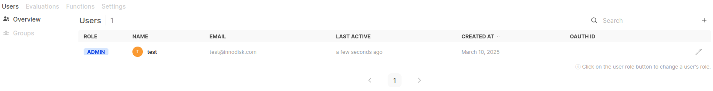

# Introduction
Developed based on [AccelBrain v0.5.18](https://github.com/ChangLijie/AccelBrain-dev__confidential), this project extends the functionality of the Agent.

## Deployment
1. **Login to AccelBrain** (with root user)  

2. Navigate to **Workspace**  and Go to **Tools** → **Import Tools**  
- After seeing the **Success** message, if the tool does not appear, try refreshing the page.

## More Information
### 🔹 Tools Lists
- **[iVIT-T](link)**: Enables AccelBrain to operate and interact with iVIT-T.
