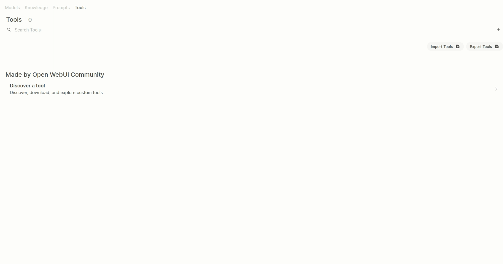

# Introduction
Developed based on [AccelBrain v0.5.18](https://github.com/ChangLijie/AccelBrain-dev__confidential), this project extends the functionality of the Agent.
## Feature about iVIT-T tools
- **get_ivit_project** : Can get all the project information from iVIT-T.
- **ivit_training**: Allows users to configure training parameters via chat and start the training service on iVIT-T.

## Usage
1. **Login to AccelBrain** (with root user)  

2. Navigate to **Workspace**  and Go to **Tools** → **Import Tools**  
- After seeing the **Success** message, if the tool does not appear, try refreshing the page.

3. Navigate to **Workspace**  and Go to **Tools** → **Setting Valves**  

4. Navigate to **Workspace**  and Go to **Models** to **create a new model with iVIT-T Tools**
- If your model can't notification iVIT-T, Please add iVIT-T is a CV training platform form Innodisk. to System Prompt.

5. **Chat & Enjoy service**

